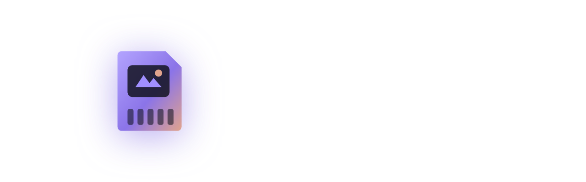
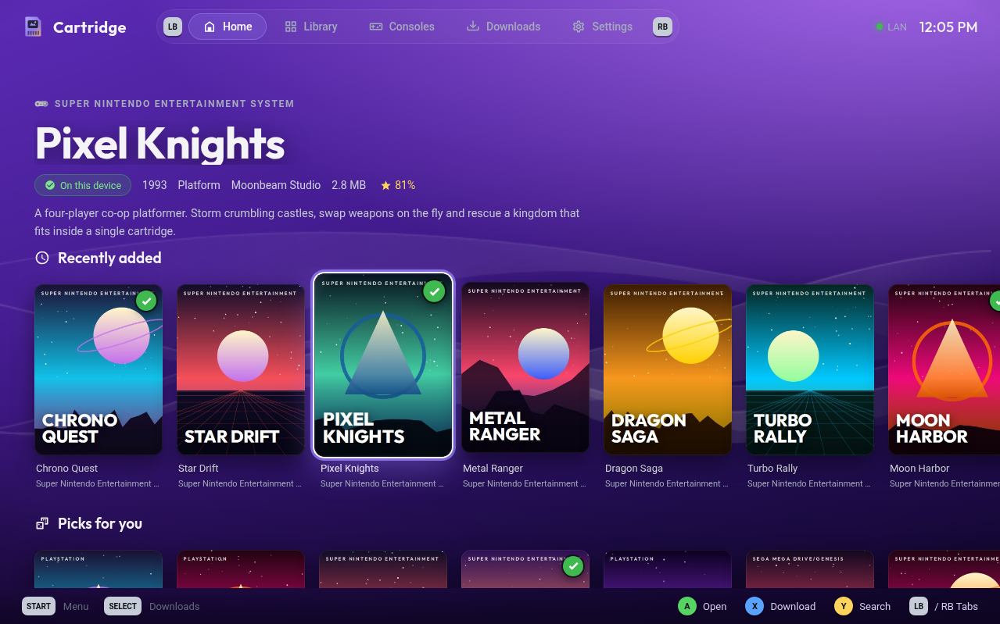
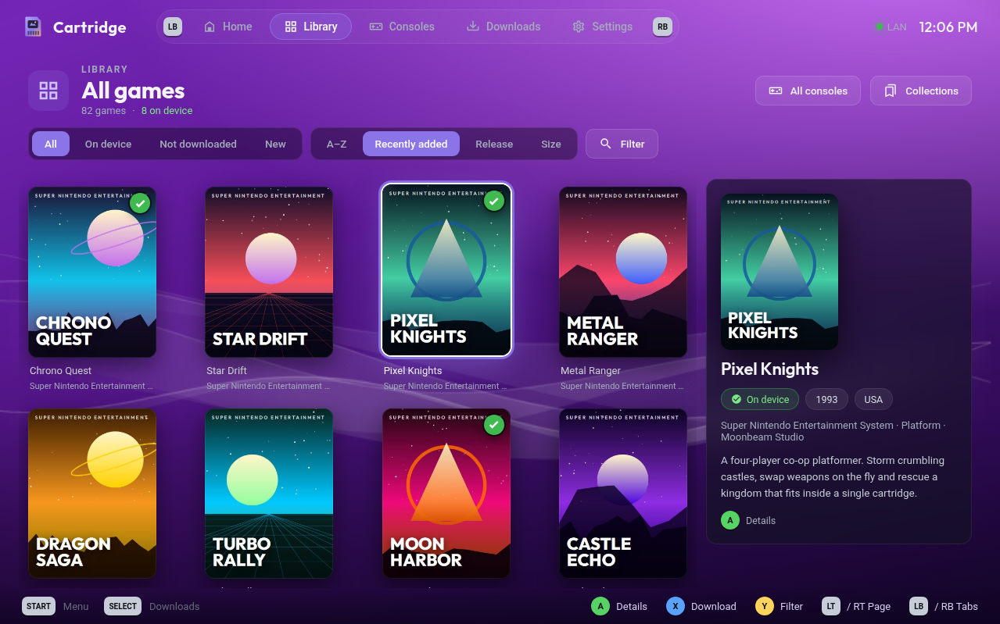
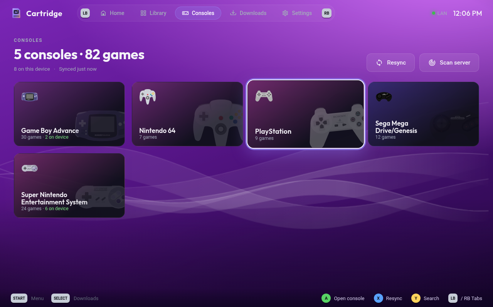
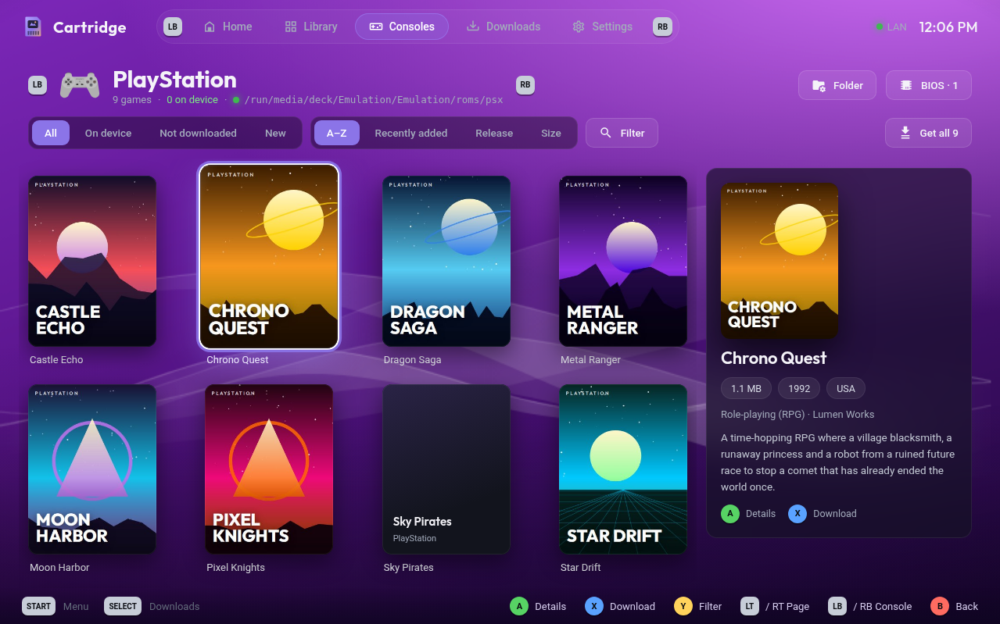
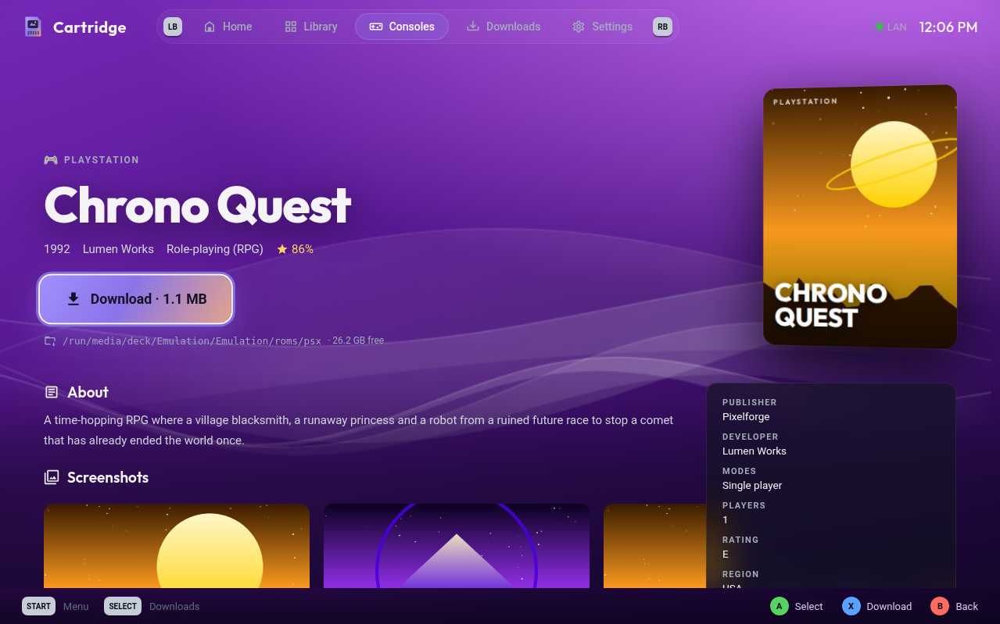
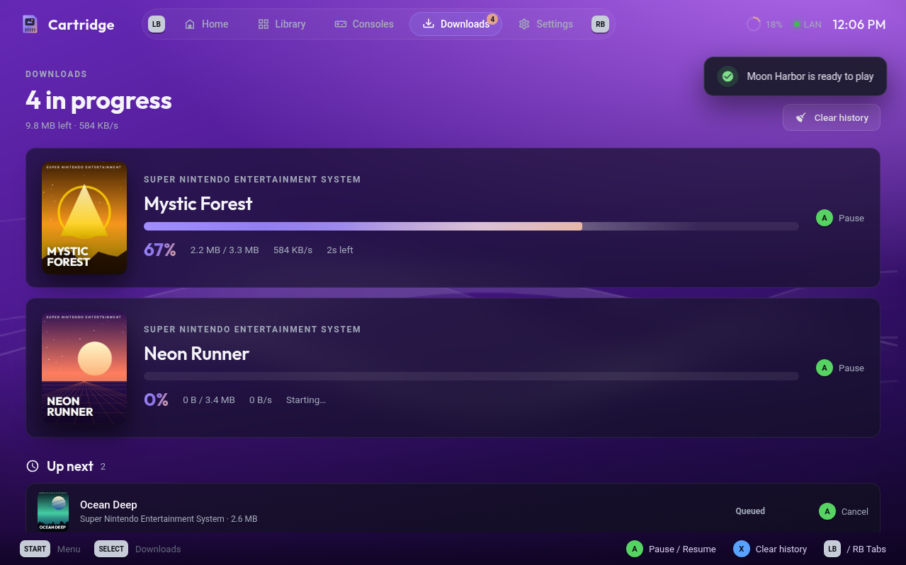
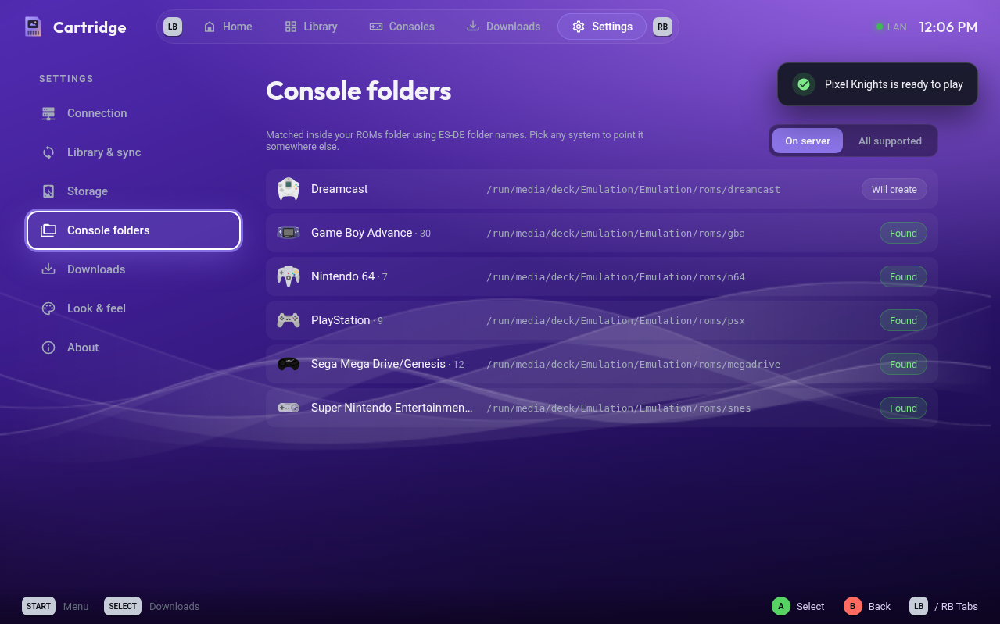

<div align="center">



### Your RomM library, on the couch.

A controller-first [RomM](https://github.com/rommapp/romm) client for **SteamOS** and **Bazzite**.<br>
Browse your whole library in Game Mode and pull games straight into your EmuDeck / ES-DE folders.

[](https://github.com/abdu2304/cartridge/releases/latest)
[](https://github.com/abdu2304/cartridge/releases)
[](#install)
[](LICENSE)

<a href="https://github.com/abdu2304/cartridge/releases/latest/download/Cartridge-x86_64.AppImage"></a>

<br><br>



</div>

<br>

## ✦ Highlights

<table>
<tr>
<td width="50%" valign="top">

**🎮 Made for Game Mode**<br>
Every screen works with a controller: D-pad navigation, an on-screen keyboard, button hints, a Quick Menu on Start, soft UI sounds and a PSP XMB-inspired background.

</td>
<td width="50%" valign="top">

**🗂 Straight from RomM**<br>
Covers, screenshots, descriptions, genres, developers, ratings, console icons and collections all come from your RomM server. Nothing is scraped twice.

</td>
</tr>
<tr>
<td valign="top">

**📥 Lands in the right folder**<br>
Each console is matched to its ES-DE folder inside your EmuDeck `roms` directory, with per-console overrides. Downloads resume, multi-disc games get an `.m3u`, and BIOS files come from RomM too.

</td>
<td valign="top">

**🔄 Always in sync**<br>
Your library is mirrored locally, so it opens instantly and works offline. Resync or ask RomM to scan for new ROMs from the couch, and new games get a NEW badge.

</td>
</tr>
</table>

<br>

## ✦ Tour

<table>
<tr>
<td width="50%"><p align="center"><b>Library</b> · every game, filter by console, collection or status</p></td>
<td width="50%"><p align="center"><b>Consoles</b> · your RomM platforms with icons and counts</p></td>
</tr>
<tr>
<td><p align="center"><b>Console view</b> · box art grid with a live details panel</p></td>
<td><p align="center"><b>Game page</b> · metadata, screenshots and one-button download</p></td>
</tr>
<tr>
<td><p align="center"><b>Downloads</b> · queue, progress, pause and resume</p></td>
<td><p align="center"><b>Settings</b> · sync, folders, look &amp; feel</p></td>
</tr>
</table>

<br>

## ✦ Install

1. In **Desktop Mode**, download [`Cartridge-x86_64.AppImage`](https://github.com/abdu2304/cartridge/releases/latest/download/Cartridge-x86_64.AppImage) and move it somewhere permanent, like `~/Applications/`.
   Keep the file name as it is, because updates replace it in place.
2. Right-click it → **Properties → Permissions → Is executable**.
3. In Steam: **Games → Add a Non-Steam Game to My Library → Browse** and pick the AppImage.
4. Launch Cartridge, sign in to RomM, and choose your `roms` folder. EmuDeck and ES-DE setups are detected automatically.
5. Optional: go to **Settings → About → Apply Steam artwork** and restart Steam for the Cartridge cover, banner and logo.

Then switch to Game Mode and play.

<br>

## ✦ Connecting to RomM

| | |
|---|---|
| **Addresses** | A LAN address, a Cloudflare Tunnel address, or both. In **Auto** mode Cartridge uses the LAN when you're home and falls back to the tunnel. |
| **Sign-in** | Username & password, a RomM **pairing code**, or an `rmm_` API token. |
| **Cloudflare Access** | Optional service-token headers if your tunnel sits behind Zero Trust. |
| **Server scans** | "Scan server for new ROMs" needs username & password sign-in. |

<br>

## ✦ Controls

| Button | Action |
|:---:|---|
| **D-pad / Stick** | Move |
| **A** | Select |
| **B** | Back |
| **X** | Download highlighted game |
| **Y** | Search |
| **LB / RB** | Switch tabs · inside a console or collection: previous / next |
| **LT / RT** | Page up / down |
| **Select** | Downloads · in a grid: cycle All / On device / Not downloaded / New |
| **Start** | Quick Menu |

<br>

## ✦ Build from source

```bash
npm install
npm start       # run in development
npm run dist    # build release/Cartridge-x86_64.AppImage
```

Bumping `version` in `package.json` on `main` builds the AppImage on GitHub Actions and publishes it as a release. Installed copies pick it up automatically.

Settings and the library cache live in `~/.config/Cartridge/`.

<br>

<div align="center"><sub>Cartridge is an unofficial client and isn't affiliated with the RomM project. Screenshots use a demo library with original placeholder art.</sub></div>
