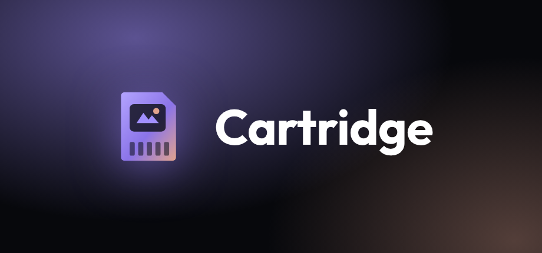

<p align="center"></p>

<p align="center"><b>Your RomM library, on the couch.</b><br>
A controller-first RomM client for SteamOS and Bazzite. Browse your library in Game Mode and pull games straight into your EmuDeck / ES-DE folders.</p>

<p align="center"><a href="https://github.com/abdu2304/cartridge/releases/latest/download/Cartridge-x86_64.AppImage"><b>⬇ Download Cartridge-x86_64.AppImage</b></a></p>


| Library | Consoles |
|---|---|
|  |  |


## What it does

- **Your RomM library, synced locally.** Opens instantly and works offline. Covers, screenshots, descriptions, genres, console icons and collections all come straight from RomM.
- **Home like RomM.** Recently added, Picks for you, On this device, New since last sync, Collections and Consoles.
- **Downloads into the right folder.** Every console is matched to its ES-DE folder name inside your EmuDeck `roms` folder, and you can override any of them.
- **Resumable downloads.** Multi-file games download file by file, and multi-disc games get an `.m3u` and a `Game.m3u/` folder so ES-DE shows them as one game.
- **BIOS** from RomM's firmware, per console.
- **Resync and Scan server** pick up new games you add to RomM, with NEW badges.
- **Built for Game Mode.** Full controller navigation, an on-screen keyboard, a PSP XMB-style background, UI sounds, and a Quick Menu on Start.
- **Connects any way.** LAN address, Cloudflare Tunnel, or both with automatic fallback. Supports username/password, RomM pairing codes, API tokens and Cloudflare Access service tokens.
- **Updates itself** from GitHub Releases.

## Install on Steam Deck / Bazzite

1. In Desktop Mode, download [`Cartridge-x86_64.AppImage`](https://github.com/abdu2304/cartridge/releases/latest/download/Cartridge-x86_64.AppImage) and move it somewhere permanent, like `~/Applications/`. Keep the file name as it is, because updates replace it in place.
2. Right-click it → Properties → Permissions → **Is executable**.
3. In Steam: **Games → Add a Non-Steam Game to My Library → Browse** and pick the AppImage.
4. Open Cartridge, sign in, and choose your `roms` folder. It auto-detects EmuDeck and ES-DE.
5. Optional: go to **Settings → About → Apply Steam artwork** and restart Steam for the Cartridge cover, banner and logo.

## Controls

| Button | Action |
|---|---|
| D-pad / left stick | Move |
| A | Select |
| B | Back |
| X | Download highlighted game |
| Y | Search |
| LB / RB | Switch tabs (inside a console or collection: previous / next) |
| LT / RT | Page up / down |
| Select | Downloads (in a grid: cycle All / On device / Not downloaded / New) |
| Start | Quick Menu: resync, scan server, updates, sounds, quit |

## Build from source

```bash
npm install
npm start          # run in development
npm run dist       # build release/Cartridge-x86_64.AppImage
```

Pushing a `v*` tag builds the AppImage on GitHub Actions and publishes it as a release, which installed copies pick up automatically.

Settings live in `~/.config/Cartridge/`.
